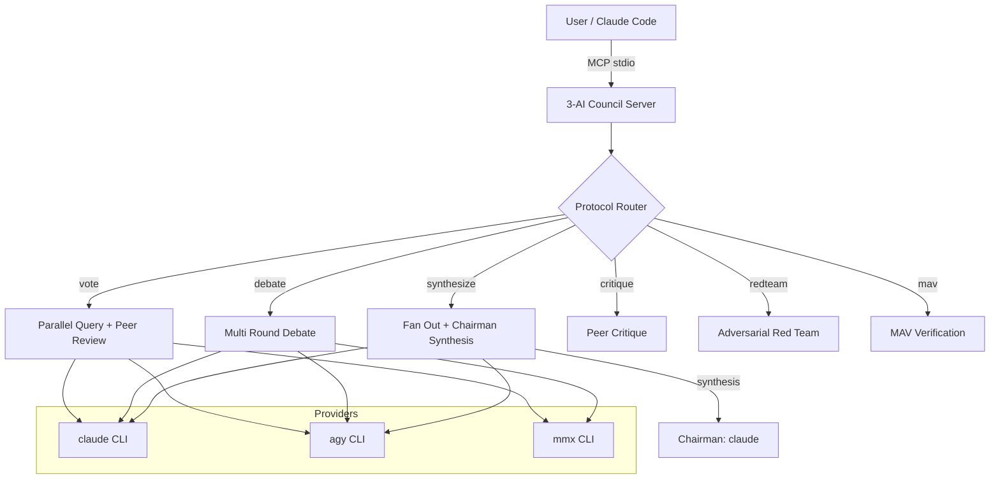

# 3-AI Debate

Multi-CLI deliberation council: send a prompt to three AI CLIs in parallel (Claude, Antigravity, MiniMax) and combine their responses through structured protocols. Ships as an MCP server and Claude Code skill.

> **Fork of [rachittshah/llmcouncil](https://github.com/rachittshah/llmcouncil)** — replaced API-based providers (OpenAI/Anthropic/Gemini SDK) with CLI-based providers (`claude`, `agy`, `mmx`).

## Why CLI instead of API?

- **No API key juggling** — uses your existing CLI auth (Antigravity IDE login, MiniMax config, Claude Code session)
- **No usage cost concerns** — all three are subscription-based
- **What you see is what you get** — the same model + prompt combination your terminal would run

## The 3 CLIs

| CLI | Model | Setup |
|-----|-------|-------|
| `claude` | Claude Opus 4.7 / Sonnet 4.6 | [Claude Code](https://docs.anthropic.com/en/docs/claude-code) |
| `agy` | Gemini 3.5 Flash | [Antigravity IDE](https://antigravity.google/) — login once, CLI inherits |
| `mmx` | MiniMax-M2.7 | `mmx-cli` from npm, see below |

### Install

```bash
# Claude Code (already installed if you're using Claude Code)
npm install -g @anthropic-ai/claude-code

# Antigravity CLI (preinstalled with Antigravity IDE)
# or: https://github.com/google-antigravity/antigravity-cli

# MiniMax CLI
npm install -g mmx-cli
mmx auth login --api-key <your-key>
```

## Protocols

| Protocol | Behavior |
|----------|----------|
| `vote` | All 3 answer independently, then anonymously rank each other. Winner by first-place votes. |
| `debate` | Multi-round argumentation. Chairman synthesizes consensus. |
| `synthesize` | Fan out, then chairman produces an authoritative synthesis. |
| `critique` | Peer review of each response. |
| `redteam` | Adversarial probe for flaws, hallucinations. |
| `mav` | Model-as-Verifier cross-checks a candidate answer. |

## Quick Start

### As MCP server (Claude Code)

```bash
# Build
npm install
npm run build

# Configure
export CLAUDE_CLI_PATH=$(which claude)
export AGY_CLI_PATH="$HOME/.local/bin/agy"   # or wherever agy is
export MMX_CLI_PATH="$HOME/npm-global/bin/mmx"

# Add to Claude Code
claude mcp add three-ai-debate node /path/to/3-ai-debate/dist/server.js
```

Then in Claude Code:
```
> Use council_deliberate to answer "should we use microservices?" protocol=synthesize
```

### As a library

```javascript
import { runCouncil } from "3-ai-debate";

const result = await runCouncil({
  question: "What's the best cache eviction policy?",
  config: {
    models: [
      { provider: "claude-cli", model: "claude", label: "ModelA" },
      { provider: "agy", model: "gemini-3.5-flash", label: "ModelB" },
      { provider: "mmx", model: "MiniMax-M2.7", label: "ModelC" },
    ],
    protocol: "synthesize",
  },
});

console.log(result.synthesis);
```

## Architecture

Same as the upstream `llmcouncil`, but providers are CLI-based:



## Configuration

### CLI Paths

If your CLIs aren't on `PATH`, set the env vars:

```bash
export CLAUDE_CLI_PATH=/custom/path/to/claude
export AGY_CLI_PATH=/custom/path/to/agy
export MMX_CLI_PATH=/custom/path/to/mmx
```

Or pass to the provider constructor (advanced).

### What about the broker?

The upstream `llmcouncil` has a peer-discovery broker for cross-network council runs. This fork drops it — all 3 CLIs run on the same machine.

## Differences from upstream

| Aspect | llmcouncil (upstream) | 3-ai-debate (this fork) |
|--------|----------------------|-------------------------|
| Providers | OpenAI / Anthropic / Gemini SDK | CLI spawn (claude / agy / mmx) |
| Token tracking | Yes | No (CLIs don't expose) |
| Pricing | Yes | No (subscription-based) |
| Broker (peer discovery) | Yes | No (single-machine) |
| Models | GPT-5.4, Gemini 2.5 Pro, Claude Sonnet 4.6 | Claude, Gemini 3.5 Flash, MiniMax-M2.7 |

## License

MIT (inherited from upstream)
